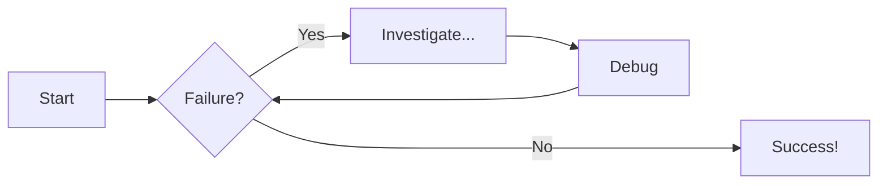
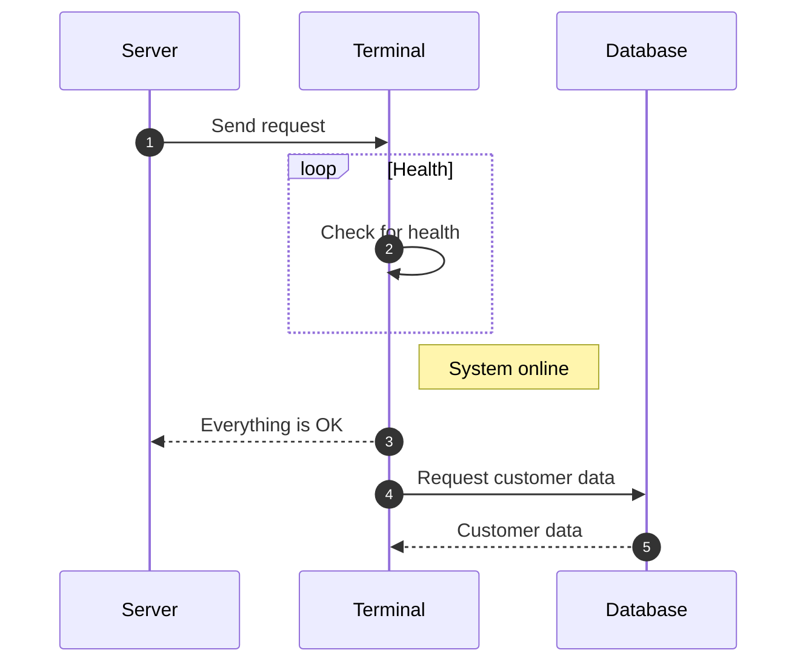
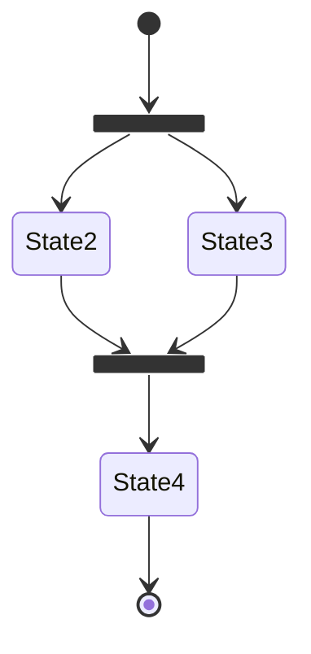
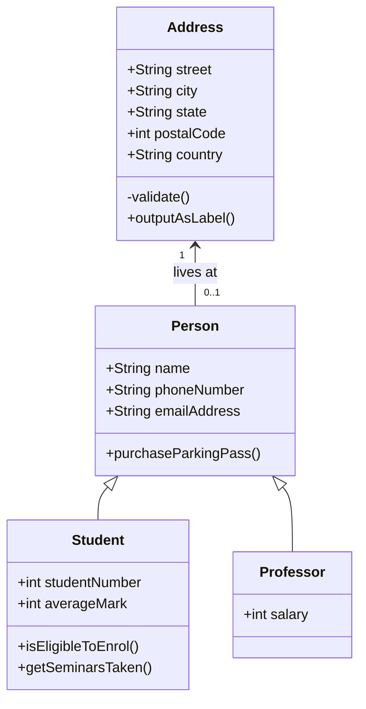
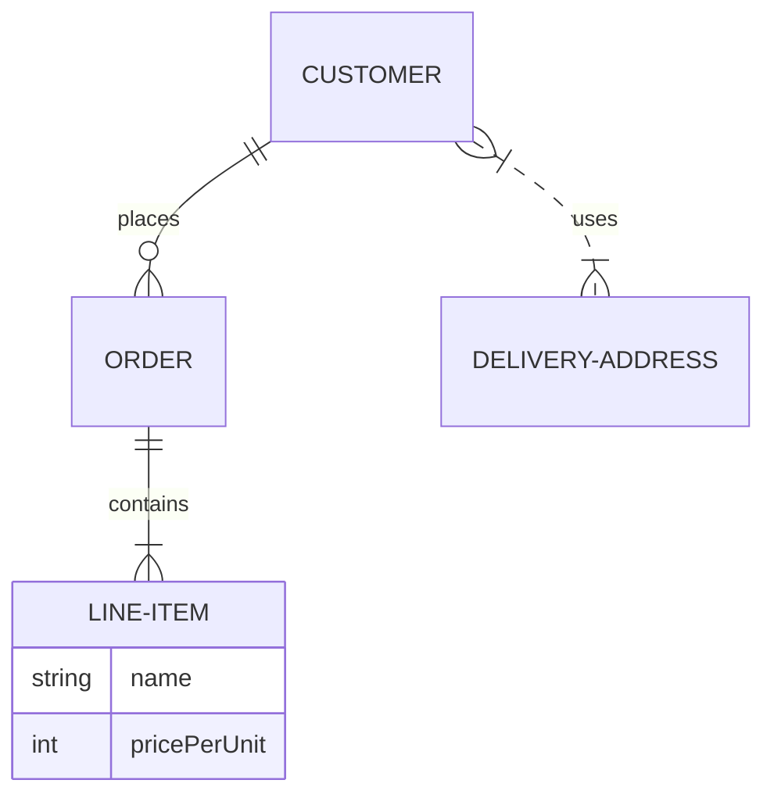

# Diagram Examples

## Flowcharts

```mermaid
graph LR
  A[Start] --> B{Failure?};
  B -->|Yes| C[Investigate...];
  C --> D[Debug];
  D --> B;
  B ---->|No| E[Success!];
```

## Sequence Diagrams

```mermaid
sequenceDiagram
  autonumber
  Server->>Terminal: Send request
  loop Health
      Terminal->>Terminal: Check for health
  end
  Note right of Terminal: System online
  Terminal-->>Server: Everything is OK
  Terminal->>Database: Request customer data
  Database-->>Terminal: Customer data
```

## State Diagrams

``` mermaid
stateDiagram-v2
  state fork_state <<fork>>
    [*] --> fork_state
    fork_state --> State2
    fork_state --> State3

    state join_state <<join>>
    State2 --> join_state
    State3 --> join_state
    join_state --> State4
    State4 --> [*]
```

## Class Diagrams

``` mermaid
classDiagram
  Person <|-- Student
  Person <|-- Professor
  Person : +String name
  Person : +String phoneNumber
  Person : +String emailAddress
  Person: +purchaseParkingPass()
  Address "1" <-- "0..1" Person:lives at
  class Student{
    +int studentNumber
    +int averageMark
    +isEligibleToEnrol()
    +getSeminarsTaken()
  }
  class Professor{
    +int salary
  }
  class Address{
    +String street
    +String city
    +String state
    +int postalCode
    +String country
    -validate()
    +outputAsLabel()  
  }
```

## Entity-Relationship Diagrams

``` mermaid
erDiagram
  CUSTOMER ||--o{ ORDER : places
  ORDER ||--|{ LINE-ITEM : contains
  LINE-ITEM {
    string name
    int pricePerUnit
  }
  CUSTOMER }|..|{ DELIVERY-ADDRESS : uses
```