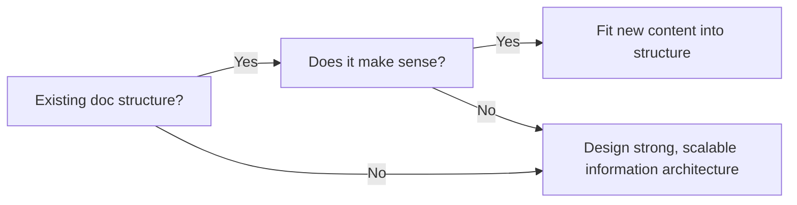

## What is it about technical writing?

I’ve worked with most kinds of technical writing, including user guides, help articles, troubleshooting documentation, white papers, API documentation. At Avast Business, I also developed the style guides and documentation processes, and built an internal knowledge base for support agents in Confluence.

My goal in building or upgrading documentation is always to focus on the needs of the **user**, not the product. 

## Process

My writing process follows this general outline:

(flow chart?)

1. Identify where we’re starting. What do the current docs look like?

2. Identify (the basics of) where we want to go. This involves empathizing with the user, asking myself what problems they have and how my docs can address those issues.

3. Build a bridge between where we are with docs and where we want to be, including the basics of what features to document, what information to include, and where we can find the details.

4. Is there an existing doc structure?

5. Gather the information through testing functionality myself, reading Jira tickets, and looking up whatever content the engineers and product managers have written in Confluence, Notion, etc.

6. Take screenshots or short videos and annotate them well. Where needed, create walkthroughs, tutorials, or videos to demonstrate user flows.

7. Bring specific questions to engineers/product managers to fill in the details that weren’t included in Jira or other internal sources. 

9. Write and edit documentation, then build documentation and push live.

10. Perform user testing to identify usability gaps for docs and the product itself. This helps me understand the unique needs of the company’s particular users.

11. Analyze doc usage stats and support tickets (esp T1) to determine what content might be missing or needs improvement.
